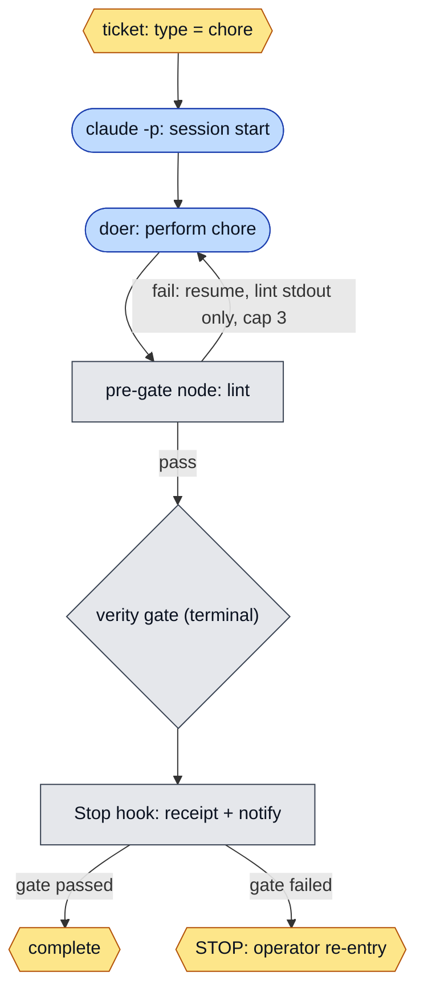
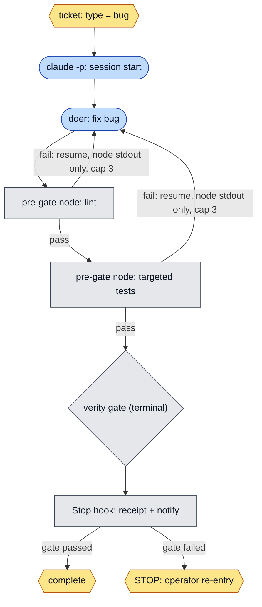
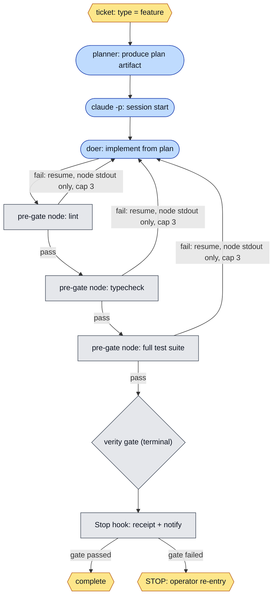
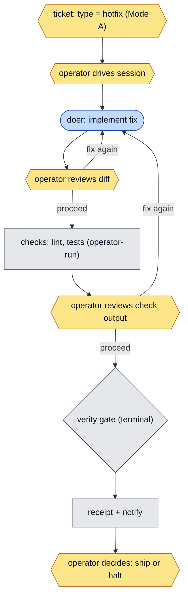

# ADR-006: Mode B ADW-ization — pre-gate orchestrator, typed specs, ADW-diagram precondition

- **Status:** Proposed
- **Date:** 2026-07-15
- **Deciders:** Pietro Falco
- **Related:** ADR-001 (execution boundary), ADR-002 (`next`, authority rule), ADR-003 (per-slice spec schema), ADR-004 (Mode B execution contract — **extended, not superseded**), ADR-005 (one spec dialect — Proposed; the field added here lands in the dialect ADR-005 makes sole); external: vault ADR-050 (dual-mode operating model — Proposed), vault ADR-054 (harness deployment topology + Mode B preconditions — Proposed).

## Context

ADR-004 (Accepted 2026-07-11) made a Mode B run a decidable, path-leased, receipted event: a single unattended `claude -p` invocation launched by the operator's runner, eligible only when machine state says so (D2), terminating in a closure receipt (D7). What ADR-004 left unspecified is the **shape of the doer's work between launch and the terminal gate**. Today that is one session that either reaches green or does not, and three things are missing:

1. **No orchestrated pre-gate loop.** A lint, typecheck, or test failure inside the session is handled — or not — by the agent's own judgment, invisibly. There is no deterministic, orchestrator-owned check that observes a real exit code, feeds a failure back as literal bytes, and bounds the retries. A "passing" run is therefore the agent's assertion, not an observation.
2. **One undifferentiated pipeline for every slice.** A chore, a bug fix, and a feature run the same model tier and the same checks, though their risk and cost profiles differ sharply. Under subscription budgets (no standing API keys, Mac M1 8GB), running a feature-grade pipeline for a one-line chore is waste.
3. **The spec declares parameters, not workflow.** The node graph a run will traverse — which steps are the agent, which are deterministic, where the operator re-enters — is implicit, so a reviewer approving `status: accepted` cannot see the shape of what they authorize.

This ADR closes those gaps as **delta-extensions over ADR-004**: a bounded pre-gate orchestrator loop (D1), a `type` discriminator with per-type pipeline templates (D2), an ADW-diagram spec-content precondition (D3), and one addition to the Mode B precondition list (D4). It turns a Mode B run from a single unattended invocation into an **Agentic Development Workflow (ADW)**: a bounded graph of agent nodes, deterministic nodes, and operator points. It is **docs-only** and changes no command behaviour, no hook, no script, and no existing spec; implementation surfaces are separate slices after Accepted.

### Relationship to prior ADRs

- **ADR-001 boundary, verbatim:** "harnesswright never spawns or supervises an agent." The pre-gate orchestrator is the **operator's runner** (the harness-pack launcher of ADR-005 D2), never harnesswright: harnesswright declares the loop as a contract and reports the `type` field; the launcher runs `claude -p --resume`. This is the ADR-005 dependency direction — the launcher consumes harnesswright; harnesswright learns nothing of a launcher.
- **ADR-003 extension:** one frontmatter field is added (`type`); no existing field is redefined (matching ADR-004's `status`/`scope`/`model` and ADR-005's `tools` additions). It lands in the ADR-003 canonical dialect — the sole dialect in a governed repo per ADR-005 D1 — never in the retired harness-pack template.
- **ADR-004 D3/D7/D8, load-bearing and unchanged:** the terminal-gate rule (D3), the closure receipt + notification (D7), and deterministic-not-LLM routing (D8) stand verbatim. This ADR adds structure *before* the gate and *selects among* ADR-004's existing tiers; it re-decides none of them.
- **vault ADR-054 D3:** the Mode B precondition list this ADR extends is enumerated there (Proposed); the amendment is a flagged on-acceptance follow-up, not made here — a harnesswright docs-only commit does not edit a vault ADR.

## Decision

**Invariant — the spine of this ADR: pre-gate checks may loop; the gate is terminal.** The bounded pre-gate loop is the *doer fixing its own work forward* before it makes a "done" claim. The verity gate is the terminal verdict *on that claim*. ADR-004 D3 governs the gate and is unchanged: a false verdict (exit 1 with a verity receipt) is a terminal stop, always, and re-running the gate is an operator act, never an automated retry. The loop never touches the gate: when the gate fails, the Stop hook writes the receipt (ADR-004 D7), the operator is notified, and the run stops. **This ADR changes no gate semantics.**

### D1 — Deterministic pre-gate orchestrator (a runner contract)

For a Mode B slice, the runner MUST structure the session as a bounded loop:

**(a)** Launch the doer, capturing a resumable session identifier. (Concrete realization in the harness-pack launcher: `claude -p`, capturing the session-id; ADR-005 D2's launcher is where this lands.)

**(b)** Run the slice's pre-gate nodes — lint, typecheck, test, as declared by the `type` template (D2) — as **orchestrator-owned nodes executed outside the agent's context**. They are never injected into the system prompt, a skill, or the spec body as agent instructions. A passing node is the orchestrator's observation of a real exit code, not the agent's self-report.

**(c)** On a node returning a **verdict of failure** (lint findings, failing tests), resume the same session passing **only the failed node's literal stdout/stderr and exit code** — no paraphrase, no summary, no orchestrator-added instruction. The orchestrator is plumbing that forwards bytes, not a judge. The verdict-presence distinction of ADR-004 D3 applies to pre-gate nodes too: a node producing *no verdict* (spawn error, resolver failure) is a transient infrastructure failure, bounded-retried per D3 (≤2), not a fix-me signal to the doer.

**(d)** The loop is bounded by `min(N, remaining budget)`, where `N` defaults to `3` and budget exhaustion (ADR-004 D1) is a stop condition by construction. The loop terminates on: all pre-gate nodes green → proceed to the terminal verity gate; or `pre-gate-exhausted` (N reached without green) → receipt + notify + stop; or budget exhausted → receipt + notify + stop. `pre-gate-exhausted` is a well-known `stop_conditions` identifier (ADR-003), and like every stop it is a halt, never an auto-retry.

### D2 — Typed specs: `type` and per-type pipeline templates

Add one frontmatter field to the ADR-003 canonical dialect:

- **`type`** — `chore | bug | feature | hotfix`. **Required when `mode: B`**; for `mode: A` it is optional and documentary (Mode A runs no autonomous pre-gate loop). No pipeline is ever silently defaulted onto a Mode B run — a missing `type` on a `mode: B` spec is a configuration error (ADR-003 exit-2 discipline). Declared by the operator in the spec (the "ticket" in this harness is the spec/ledger entry); **never inferred by an LLM** (coherent with ADR-004 D5's explicit-never-inferred selector and D8c's no-LLM-router rule).

`type` is a **template that populates existing fields**, not a new routing authority. Each type declares a default effort tier, pre-gate node set, whether a planner pass runs, and Mode eligibility; the concrete model still resolves through ADR-004 D8 (effort→tier) and the pack manifest's tier→model map (ADR-005 D4). harnesswright gains no model catalogue (ADR-004 D8 non-goal, verbatim). Tiers are named in ADR-004's vocabulary; the Haiku- or Sonnet-class model each resolves to is the pack manifest's business.

| `type` | default effort → tier (ADR-004 D8) | pre-gate nodes (D1) | planner pass | Mode |
|---|---|---|---|---|
| `chore` | `low` → worker | lint | no | B eligible |
| `bug` | `high` → executor | lint, targeted tests | no | B eligible |
| `feature` | `high` → executor | lint, typecheck, full suite | yes | B eligible |
| `hotfix` | `high` → executor | operator-defined (exceptional) | operator-defined | **A only** |

- The template is a **default, not a lock**: an explicit `effort`, `model`, or `stop_conditions` in the spec overrides the type default (one authoritative value per field; the explicit declaration wins), and the override is visible in review.
- **`hotfix` forces Mode A.** A `type: hotfix` spec is **not Mode-B-eligible**; the pair `(hotfix, B)` is a configuration error. The pre-gate orchestrator (D1) does not run autonomously for a hotfix; the operator is in the loop at every checkpoint. An autonomous incident pipeline is deferred until an incident-grade contract exists.
- The **planner pass** (feature) is an agent node producing a plan artifact *before* the doer node; in v1 it shares the run's budget and is not a separate session lifecycle. Its output is committed with the slice's evidence, so a reviewer sees the plan the doer worked from.

### D3 — ADW-diagram precondition on the Accepted Mode B spec

A Mode B spec's **body** MUST contain exactly one fenced `mermaid` diagram of its ADW, with **three visually distinct node classes**: agent nodes, deterministic nodes, and operator points. The diagram makes the workflow a reviewer approves at `status: accepted` inspectable rather than implicit.

- **Presence is machine-checkable** (a fenced `mermaid` block in the body) under ADR-003's exit-2 discipline, like a missing required field; the surfacing check is an implementation slice (a `doctor`/validator check) after Accepted, per ADR-003.
- **Faithfulness is not machine-checkable.** Whether the diagram truthfully depicts the run is a **review-blocking defect in the spec's two-commit lifecycle where machine validation cannot reach prose** — the class ADR-004 D5 names for temporal-binding declarations. This ADR does not pretend a diagram is a verified artifact: its presence is a gate; its correctness is a human review.
- The visual convention is fixed so the three kinds are legible in monochrome: **agent** nodes are stadium-shaped, **deterministic** nodes rectangular (the verity gate a rhombus, as it branches), **operator** points hexagonal — distinguished by both shape and `classDef` fill. The four reference ADWs below are the templates a spec's diagram instantiates, one per `type`.

**chore**

**bug**

**feature**

**hotfix (Mode A — attended; no autonomous pre-gate loop)**

The contrast is the point: in Mode B the loop is an automated agent↔deterministic edge, bounded by `cap 3`; in the hotfix (Mode A) the only loops back to the doer pass *through an operator hexagon* — there is no autonomous edge.

### D4 — Mode B preconditions: one addition, and a flagged vault amendment

The Mode B preconditions are enumerated across ADR-004 D2 (machine eligibility: unlocked slice, spec parses valid, `mode: B`, `status: accepted`, no lock) and vault ADR-054 D3 (a dedicated worktree with disjoint scope, wired hooks, target `launch-eligible`). This ADR adds one:

- **The Accepted spec contains a valid ADW diagram (D3).**

The canonical vault-side list in **vault ADR-054 D3** is amended to reference this precondition **on acceptance of this ADR** — a flagged follow-up, not an edit made in this docs-only harnesswright commit (a harnesswright commit does not modify a vault ADR, and vault ADR-054 is itself Proposed). This is the cross-repo flag pattern of vault ADR-050, whose policy-table amendment "takes effect on acceptance … implemented in S24/S25, not in this commit".

## Non-goals

- **No gate-semantics change.** ADR-004 D3 (terminal gate, no auto-retry) and D7 (closure receipt + notification) stand verbatim. The pre-gate loop is strictly upstream of the gate.
- **No execution or orchestration by harnesswright.** ADR-001 verbatim: the pre-gate orchestrator is the operator's runner (the harness-pack launcher, ADR-005 D2). harnesswright declares the contract and reports `type`; it spawns and supervises nothing.
- **No LLM in any decision node.** Pre-gate nodes are deterministic (exit codes); `type` is operator-declared, never inferred; routing is a deterministic function of spec fields (ADR-004 D8c). No evaluator, judge, or classifier is introduced.
- **No model catalogue in harnesswright.** `type` selects an ADR-004 tier; tier→model resolution stays in the pack manifest (ADR-005 D4). Haiku/Sonnet are never named in harnesswright.
- **No new completion-state source.** `.harness/harness.json` remains sole (ADR-002); `type`, pre-gate results, and the ADW diagram describe *how* a slice runs, never *whether* it passed.
- **No autonomous hotfix.** `type: hotfix` is Mode A only in this ADR; an unattended incident pipeline is out of scope.
- **No spec translation and no second dialect.** `type` is added to the ADR-003 canonical dialect only; the retired harness-pack template dialect (ADR-005 D1) gains nothing.
- **No planner beyond a single pre-doer pass in v1.** Multi-stage planning, plan critique, and plan/act separation across sessions are deferred.

## Alternatives considered

1. **An LLM evaluator/judge in the pre-gate loop** (an agent scores the doer's output and decides whether to loop). Rejected — programmatic over LLM. It reintroduces the non-deterministic judgment the harness exists to remove, and an agent-judge inside the runner is the ADR-001-class concern ADR-004 D8c and its alternative 9 already reject outright. The pre-gate loop's decision is an exit code, not an opinion.
2. **Racing agents** (N concurrent doers per slice, keep the best). Deferred to quarantine, not adopted: under subscription budgets it multiplies cost linearly; it requires the path-lease disjointness of ADR-004 D4 to be safe to parallelize; and its selection step is either an LLM judge (rejected, per 1) or a deterministic tie-break not yet designed. Parked for a dedicated quarantine slice.
3. **`type` maps directly to a concrete model**, bypassing ADR-004 D8's effort→tier routing. Rejected: it creates a second routing authority for the same fact (which model) and forces a model catalogue into harnesswright (ADR-004 D8 non-goal). `type` sets a default *tier*; D8 and the pack manifest resolve the model.
4. **Infer `type` from the ticket text with a classifier.** Rejected: same class as inferring `mode` (ADR-004 D5 rejected an inferred selector). A stale or mis-parsed inference would silently pick the wrong pipeline — a feature graded as a chore, skipping the suite. `type` is operator-declared.
5. **Put the pre-gate loop inside the agent's own instructions** (tell the doer to lint/test itself and iterate). Rejected: it is the confabulation surface — a self-checking agent reports its own verdicts, so a "passing" run is an assertion, not an observation. The nodes are orchestrator-owned and run outside the agent's context (D1b); failures return as literal bytes (D1c).
6. **Unbounded pre-gate loop** (retry until green). Rejected: it is an auto-retry by another name and can burn a budget silently against a defect the agent cannot fix. The loop is bounded by `min(N, budget)` and exhaustion is a stop (D1d).
7. **Machine-verify the ADW diagram's correctness.** Rejected as infeasible and dishonest: diagram-to-run faithfulness is prose-level and beyond deterministic validation. Presence is checked; correctness is a review gate (D3), matching ADR-004 D5's treatment of what machine validation cannot reach.

## Consequences

- **Positive:** a Mode B run gains a bounded, deterministic, orchestrator-owned feedback loop whose verdicts are observed exit codes, not agent claims — the input-side literalness ADR-003 gave the contract, extended to the doer's iteration. Work is right-sized to its risk and cost (a chore no longer pays for a feature's pipeline), which matters directly under subscription budgets. The workflow a reviewer authorizes at `status: accepted` becomes a visible diagram instead of implicit structure. The terminal-gate contract (ADR-004 D3/D7) is untouched, so the safety spine is unchanged while the doer phase gains structure.
- **Negative / accepted risks:** **(a)** one more spec field (`type`) and one more body requirement (the ADW diagram) widen what review must read — bounded: `type` is one enum required only for Mode B, the diagram is one block; **(b)** the pre-gate loop is a runner contract harnesswright cannot enforce (ADR-001) — accepted, exactly as ADR-004 D7's receipt is a contract the runner must honour; harnesswright can report `type` and, at implementation, a validator can check diagram presence, but it cannot force the loop's production; **(c)** the ADW diagram's *correctness* is unverifiable and can drift from the real run — mitigated only by review and by ADR-004 D7's receipt recording the actual nodes traversed, against which a reviewer can compare; **(d)** per-type templates are opinionated (the chore/bug/feature/hotfix cut, the tier defaults) — mitigated by the template being a per-field-overridable default and by Proposed-status review; **(e)** the field lands in the ADR-005 canonical dialect, so this ADR inherits a soft dependency on ADR-005 reaching Accepted — mild, because ADR-003 (the dialect itself) is Accepted and `type` is a valid delta regardless of ADR-005's fate.

## Status

Proposed. Per the two-commit ADR lifecycle, acceptance requires operator review and a separate ratification commit; implementation slices (the `type` field in `parseSpec`/`next --json`, the pre-gate loop in the harness-pack launcher, the diagram-presence validator, the vault ADR-054 D3 amendment) are blocked until then. By operator directive, acceptance of this ADR is **sequenced behind vault ADR-050 (dual-mode operating model) and vault ADR-054 (harness deployment topology) reaching Accepted**, since this ADR evolves Mode B, whose base model and precondition list those ADRs define. Cross-repo references use the ADR-051 prefixed form (`vault ADR-050`, `vault ADR-054`); this ADR is cited elsewhere as `harnesswright/ADR-006`.
